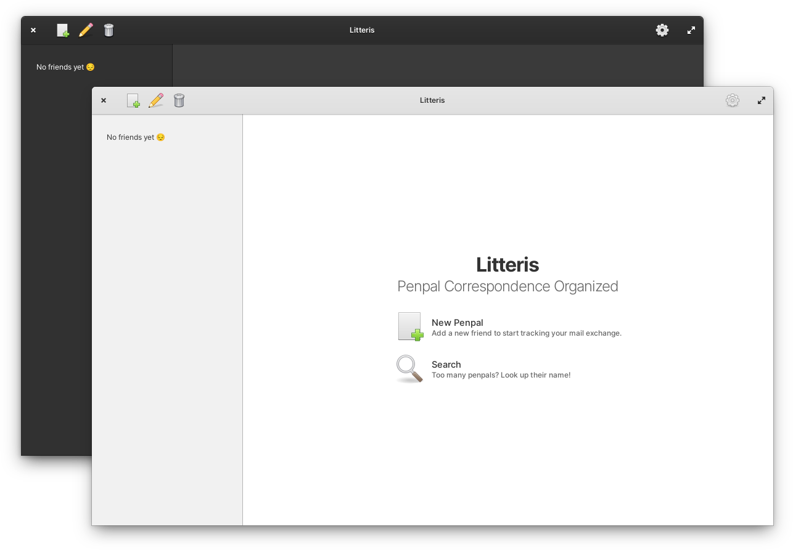

<!--
* Copyright (c) 2019 Raí B. Toffoletto (https://toffoletto.me)
*
* This program is free software; you can redistribute it and/or
* modify it under the terms of the GNU General Public
* License as published by the Free Software Foundation; either
* version 2 of the License, or (at your option) any later version.
*
* This program is distributed in the hope that it will be useful,
* but WITHOUT ANY WARRANTY; without even the implied warranty of
* MERCHANTABILITY or FITNESS FOR A PARTICULAR PURPOSE.  See the GNU
* General Public License for more details.
*
* You should have received a copy of the GNU General Public
* License along with this program; if not, write to the
* Free Software Foundation, Inc., 51 Franklin Street, Fifth Floor,
* Boston, MA 02110-1301 USA
*
* Authored by: Raí B. Toffoletto <rai@toffoletto.me>
-->

<p>
  
  <a href="https://appcenter.elementary.io/com.github.raibtoffoletto.litteris">
    
  </a>
  <h1 class="rich-diff-level-zero">
    Litteris
  </h1>
</p>


### Penpal Correspondence Organized
> With Litteris you can organize your penpal contacts
> and keep track of your letters and postcards exchange. <br />
> You can star your most frequent friends and search for that one you haven't talked much lately.



## Install, build and run
### Dependencies:
 - libgtk-3-0
 - libgranite-dev
 - libsqlite3-dev
 - libgee-0.8-dev
 - meson
 - valac

`$ sudo apt-get install elementary-sdk libsqlite3-dev libgee-0.8-dev -y`

### Clone and Compile
```bash
$ git clone https://github.com/raibtoffoletto/litteris.git
$ cd litteris
$ meson build --prefix=/usr

$ cd build
$ ninja
$ sudo ninja install
```

### Generating i18n files
```bash
# in ./build directory
$ ninja com.github.raibtoffoletto.litteris-pot
$ ninja com.github.raibtoffoletto.litteris-update-po
$ ninja extra-pot
$ ninja extra-update-po
```

## How to contribute:
All contributions, code improvements, translation, bug solving, etc. are mostly welcome. The pull requests should be made to the branch **unstable**.

